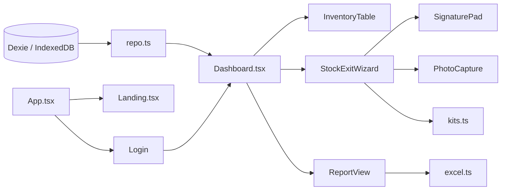

# 🧭 ANA NAVİGASYON — WMS Plan Seti

> Bu dosya tüm planların **tek giriş noktasıdır**. Her ajan ve geliştirici buradan başlar.
> Gerçek mimari: **React 19 + TypeScript + Vite + Tailwind v4**, veri katmanı **Dexie.js (IndexedDB)**.
> Font: **Inter + Manrope** (bu projeye özel karar — değiştirme).

---

## 📌 Önce Oku (Zorunlu)
| Dosya | Amaç |
|---|---|
| [UNUTULMAMASI-GEREKENLER.md](./UNUTULMAMASI-GEREKENLER.md) | ❌ Yapma / ✅ Yap kırmızı çizgileri — **iş başlamadan oku** |
| [MASTER-PLAN](../../karot/sessions/260627-warm-pine/plans/MASTER-PLAN.md) | Üst seviye strateji & faz akışı |

---

## 📚 Plan Dosyaları

| # | Plan | Konu | Durum | İlgili Kod |
|---|---|---|---|---|
| 00 | [Genel Bakış](./00-genel-bakis.md) | Proje amacı, modüller | ✅ Hazır | — |
| 01 | [Roller ve Yetkiler](./01-roller-ve-yetkiler.md) | admin/personnel + TR etiket | 🔄 Hizalanacak | `Login.tsx`, `Dashboard.tsx` |
| 02 | [Veri Şeması](./02-veritabani-semasi.md) | Dexie tabloları (TS interface) | 🔄 Dexie'ye | `src/lib/db.ts`, `types.ts` |
| 03 | [Malzeme Girişi](./03-malzeme-girisi.md) | Giriş formu | 🔄 | `ProductForm.tsx` |
| 04 | [Malzeme Çıkışı Akışı](./04-malzeme-cikisi-akisi.md) | Stepper sihirbaz | ⏳ Yeni | `StockExitWizard.tsx` |
| 05 | [Kıyafet Kategorileri](./05-kiyafet-kategorileri.md) | Kit JSON mantığı | ⏳ | `src/data/kits.ts` |
| 06 | [İmza & Fotoğraf](./06-imza-ve-fotograf.md) | Canvas imza + foto | ⏳ Yeni | `SignaturePad.tsx`, `PhotoCapture.tsx` |
| 07 | [Rapor & Excel](./07-rapor-ve-excel.md) | Client-side xlsx | 🔄 | `ReportView.tsx`, `src/lib/excel.ts` |
| 08 | [Teknik Mimari](./08-teknik-mimari.md) | Gerçek yığın | 🔄 | tüm proje |
| 09 | [Yol Haritası](./09-yol-haritasi.md) | Fazlar | 🔄 | — |
| 10 | [Landing Page](./10-landing-page.md) | E-E-A-T tanıtım | ⏳ Yeni | `Landing.tsx` |
| 11 | [Oturum Yönetimi](./11-oturum-yonetimi.md) | Kalıcı giriş + süre (F5 fix) | ⏳ Yeni | `lib/session.ts`, `App.tsx`, `SettingsView.tsx` |
| 12 | [Görev & Hatırlatıcı](./12-gorev-ve-hatirlatici.md) | Görev/zil/zamanlama | ⏳ Yeni | `TaskCenter.tsx`, `Dashboard.tsx` |
| 13 | [Gelişmiş Rapor](./13-rapor-gelismis.md) | Günlük hareket raporu | 🔄 | `ReportView.tsx`, `lib/io.ts` |
| 14 | [Toplu Giriş/Çıkış + Kanıt](./14-toplu-giris-cikis.md) | Toplu işlem + fatura/foto | ⏳ Yeni | `StockEntry.tsx`, `QuickExit.tsx` |

**Durum:** ✅ tamam · 🔄 güncelleniyor/uyarlanıyor · ⏳ yeni geliştirme

---

## 🗺️ Modül → Kod Haritası


## ⚙️ Komutlar
```bash
cd C:/xampp/htdocs/proje
npm install        # bağımlılıklar (dexie eklenecek)
npm run dev        # geliştirme (port 3000)
npm run build      # üretim derlemesi
npm run lint       # tsc --noEmit (tip kontrolü)
```
